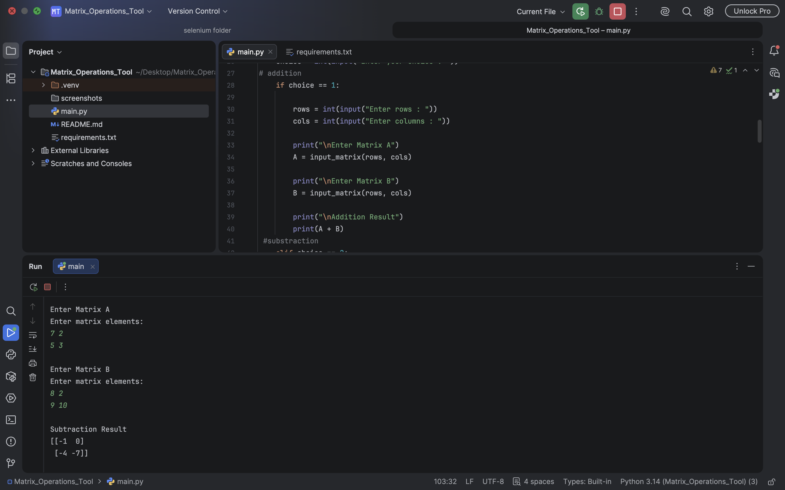
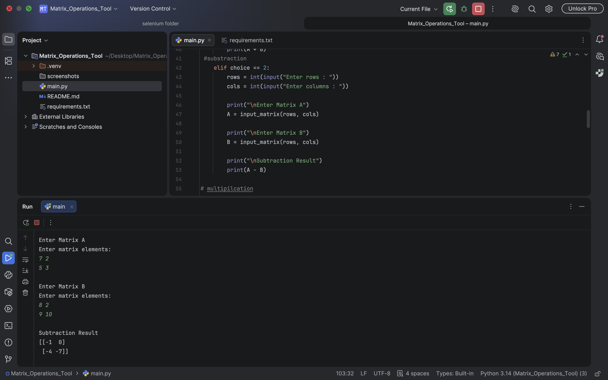
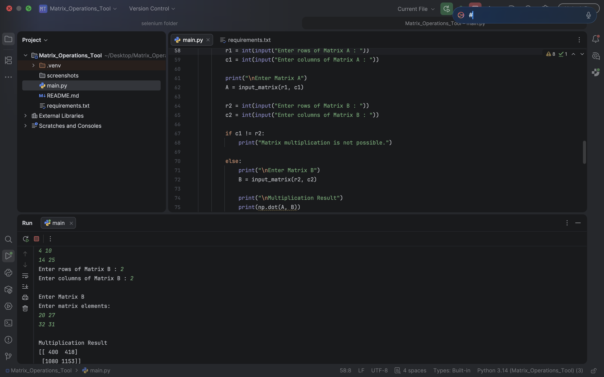
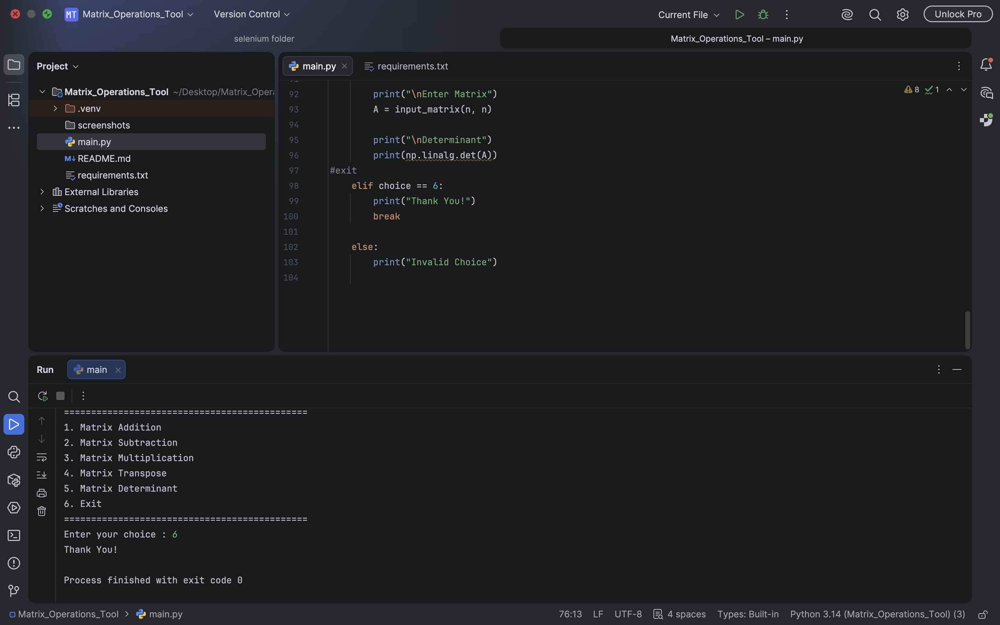

# Matrix Operations Tool

## Project Description

The Matrix Operations Tool is a Python application developed using NumPy. It allows users to perform different matrix operations through a simple menu-driven interface.

## Features

- Matrix Addition
- Matrix Subtraction
- Matrix Multiplication
- Matrix Transpose
- Matrix Determinant
- Menu-driven program
- Input validation for invalid choices

## Technologies Used

- Python 3
- NumPy
- PyCharm

## Requirements

Install NumPy before running the project:

```bash
pip install numpy
```

## How to Run

```bash
python main.py
```

## Sample Menu

```text
1. Matrix Addition
2. Matrix Subtraction
3. Matrix Multiplication
4. Matrix Transpose
5. Matrix Determinant
6. Exit
```

## Screenshots

### Matrix Addition



### Matrix Subtraction



### Matrix Multiplication



### Matrix Transpose


### Matrix Determinant


### Exit



## Author

Developed by **Chodavarapu Sushmitha**